# PDF Template Maker
> Version: 1.2

## 1. INTRODUCTION
**PDF Template Maker** was created to solve the problem of creating simple templates fast and easy by providing a user-friendly interface for crafting personalized PDF documents by utilizing HTML elements so they can be used within another project under the name of *Fipu Internship System*. *PDF Template Maker* template is separate from *PDF Template Maker Service* which sole purpose is to convert created templates with provided inputs using *Playwright* into PDFs.

*PDF Template Maker* can be used on [live site](https://html-to-pdf-maker.netlify.app) or *locally* by following steps in [2. Getting Started](#2-getting-started) section.

### 1.1 Features
- **Drag-and-Drop Editing**: Arrange and customize elements within your PDF templates using vue-draggable
- **Text Editing**: Edit text content using vue3-quill & katex
- **Variable Preview**: Check how template/PDF would look prior to export
- **Saving templates and PDF Export**: Save and load your templates for later use. Export your PDFs using vue-html-to-paper

## 2. Getting Started
To run project locally use the following steps:

1. Clone this repository to your local environment.
2. Install the required dependencies using `npm install`.
4. Execute command `node build.js` to generate the necessary CSS classes.
3. Run the development server using `npm run dev` and access the app at the provided link.

The project is now ready to be used.

## 3. Interface
Interface is comprising of the following sections:
- **Canvas**
- **Editor Bar**
- **Element Settings**
- **Toolbar**

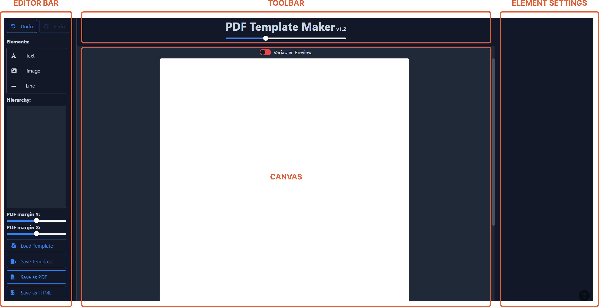

### 3.1. Canvas
Upon opening the PDF Template maker you'll be provided with a blank sheet of paper called *canvas*. 

This so called *canvas* will be in the middle of the screen available at all times. It's your workspace where you will drag and drop, edit, rearrange, clone and deleted *PDF elements*.

These is also a toggle called **Variable Preview** which is used to test template and see how it behaves with different inputs, more about later.

### 3.2. Editor Bar
Left of *canvas* is where *editor bar* is located. It can be divided into 5 subsections:

- **undo/redo**
- **elements**
- **hierarchy**
- **PDF margins**
- **importing/exporting**

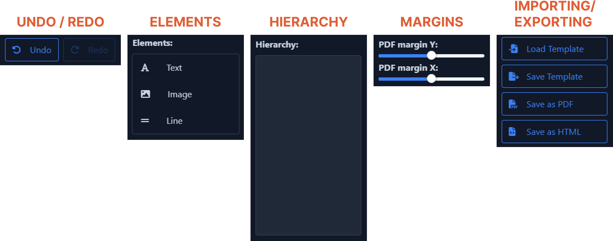

#### 3.2.1. Undo/redo
Self explanatory, almost every program in existence has those function. Tho there are few things to note:
- key shortcuts `CTRL+Z/CTRL+Y` don't work due to *Quill* text editor, therefore to undo/redo use the provided buttons
- if no undo/redo action is possible buttons will be faded and not clickable
- undo stack size is `200`
- every character typed in text counts as action
- redo won't be cleared if after undoing, change is applied. Same for undo.

#### 3.2.2. Elements
This subsection contains a **list** of available *elements* that can be used to create template.
There are currently `3` available *elements* to choose from:

- **Text**
- **Image**
- **Line**

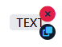

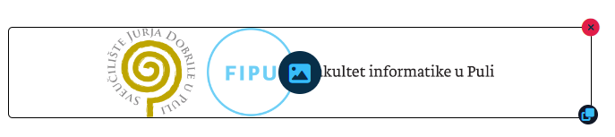

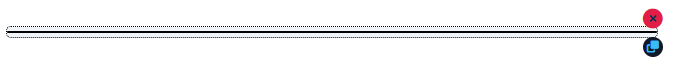 

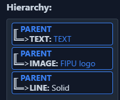

To use the provided *elements* simply **drag and drop** them into *canvas*. When *element* is put onto *canvas* ***parent** element* is created that contains dropped *element*. 

Newly **created** *element* can be:
- **selected**: to **select** *element* simply **click** the *element*
- **moved**: to **move** *element* from *canvas* around, **click and hold** the *element* **4-way arrow **icon
- **deleted**: to **delete** *element* from *parent*, **click** the *selected element* **red x** icon
- **cloned**: to **clone** *element* inside *parent*, **click** the *selected element* **blue double square** icon

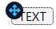 

**Image** *element* has additional **blue image icon** in the *center* which when clicked opens *popup* where *image* **url** can be changed.

> Note: **New** *element* can be moved into *hierarchy* directly and will therefore also be created on canvas, tho only as ***new** parent* with provided *element* not as *new element* inside existing *parent*.

> Note: *Elements* can be moved into *elements **list***, doing so will **delete** moved *element*.

***Parent*** is an *element* that contains other *elements* **horizontally** therefore if there are many *elements* in a single *parent* and there is not enough space *elements* will **overflow**. To prevent *overflowing* appropriate use od *element* **width setting** is needed, more about it later.

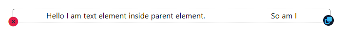

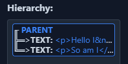

Newly **created** *parent* can be:
- **moved**: to **move** *parent* from *canvas* around, **click and hold** inside the *parent* **bounds** don't click *child* el*ements, doing so will select *child* *element* 
- **deleted**: to **delete** *parent* from *canvas*, **click** the *parent* **red x** icon, doing so will **delete** all *child elements* inside *parent*
- **cloned**: to **clone** *parent* inside *canvas*, **click** the *parent* **blue double square** icon, doing so will **clone** entire *parent* with all it's *child elements* onto *canvas*

> Note: *Elements* can be moved from one *parent* to another. If when moving *element* from *parent* leaves the *parent* empty without elements, *parent* is **deleted**.

> Note: Two *parents* can be **merged** by moving one *parent* into another at any spot.

> Note: *parent* **cannot** be **selected**.

#### 3.2.3. Hierarchy
Third subsection in *Editor Bar* used to visually present *canvas element* **structure** in a **tree** like view.
Few *hierarchy* images were showed in previos section since it's easier to showcase how *parents* and *elements* work.

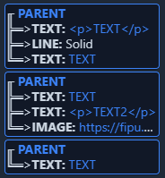

Each *parent* in *hierarchy* is presented with **bold blue** text and with **arrows** pointing to it's *children elements*. *Child elements* shows their **type** in **bold white** and it's **content** or **value** after `:`

**Hovering** with mouse over* parent/elements* will **highlight** and **scroll to** *parent/element* on *canvas* and *vice-versa*. ***Selected*** *element* is **highlited** in **blue**.

> Note: on mouse *hover* for few second: on *parent* will show **parent ID**, on *type* will show **child element ID**, on *content/value* will show **entire** *content/value*

> Note: *Elements* and *parents* can be moved around *hierarchy* and from *hierarchy* but it is **NOT** recommended since it can behave **unexpectedly** and **break** the program. Use *canvas* for moving *elements*/*parents* instead.

#### 3.2.4. Margins

Margins are used to create **padding** for *canvas* *elements*.

- **PDF margin Y**  controls **vertical** padding (*top & bottom*) from `0.25 - 1.25` inches 
- **PDF margin X**  controls **horizontal** padding (*left & right*) from `0.25 - 1.25` inches 

 

> Note: margins do **not** prevent *element* **overflow**

#### 3.2.5. Importing/exporting

The last subsection contatins `4` *functions* for **importing** & **exporting** *templates*:

1. **Load template**
    - opens window for loading **locally saved** *template* in specified **JSON** format, upon loading the *canvas* will update accordingly along with it *hierarchy* will too
2. **Save template**
    - opens *popup* for providing **name** with which the *template* will be **locally saved** in specific **JSON** format

3. **Save as PDF**
    - opens *browser PDF saving funcionality* that allows to export *canvas* in it's **current stat**e as *PDF file*
4. **Save as HTML**
    - opens *popup* for providing **name** with which the *template* will be **locally saved** in specific **HTML** format

    > Note: *saved HTML* **won't** contain any *CSS formating*

### 3.3. Element Settings
Located right of *canvas* with two main functinallities. First one and the most important is of course as *name* implies **settings** for ***selected*** *element* where specific *values* can be adjusted and second one **variablse preview list** for **testing** *templates*.

> Note: if **no** *element* is selected and *variable preview* is turned **off** *elements settings* will be **empty**.

#### 3.3.1. Settings

Each *element type* has it's own unique settings, but they also share many settings amongst themselves and since each and every *element* is inside *parent* they all contain *parent* settings since *parents* cannot be selected. All *elemets* also have *element data* which is **ID** and **Type** *readonly*.

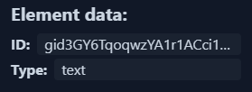 

**Parent** *element* settings are:
- **Parent Height**: controlls the *parent* height **type**
    - **Fit**: matches the height of biggest *child* *element*
    - **Divide**: adjusts height so that it occupies equal space as other *parents* with **divide** height type
    - **Grow**: expands height so that it occupies all space left in canvas
    - **Set**: provides *additional number input* to set **exact** height in **pixels**

- **Justify Parent**: controlls the the way *child* elements will be **aligned horizontally**
    - **Start**: aligns *children* against the **start** of *parent*
    - **Center**: aligns *children* in **center** of *parent*
    - **End**: aligns *children* against the **end**  of *parent*
    - **Between**: aligns *children* in such way that there is an *equal* amount of space **between** each *child*
    - **Around**: aligns *children* in such way that there is an *equal* amount of space on **each side** of each *child*
    - **Evenly**: aligns *children* in such way that there is an *equal* amount of space **around** each *child*, but also **accounting** for the **doubling of space**

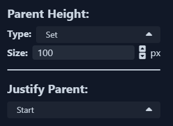

**General** *element* settings are:
- **Element Width**: controlls the *element* width **type**
    - **Fit**: matches the width of *element* *content*
    - **Divide**: adjusts width so that it occupies equal space as other *elements* with **divide** width type within *parent* 
    - **Grow**: expands width so that it occupies all space left in *parent*
    - **Set**: provides *additional number input* to set **exact** width in **pixels**
- **Element Height**: controlls the *element* height **type**
    - **Fit**: matches the height of *element* *content*
    - **Grow**: expands height so that it occupies all space left in *parent*
    - **Set**: provides *additional number input* to set **exact** height in **pixels**

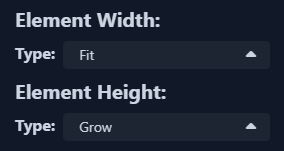

**Text** *element* setting is:
- **Text value**: *readonly* **field** that shows text *value*

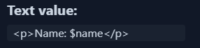 

**Image** *element* settings are:
- **Image URL**: *readonly* **field** that shows image **url** *value*
- **Size**: controlls the *image* **size** within *element*
    - **Auto**: *displays* the image at its **default** size
    - **Cover**: *scales* image until it **fills** the *element*
    - **Contain**: *scales* image to the **outer edge**s of *element* without *cropping* or *stretching*
- **Position**: controlls the *image* **position** within *element*
    - *Bottom, Center, Left, Left bottom, Left top, Right, Right bottom, Right top, Top*
- **Repeat**: controlls the *image* **repetition** within *element*
    - **No repeat**: image **won't** *repeat*
    - **Repeat**: image will *repeat* in **horizontally** & **vertically**
    - **Repeat X**: image will *repeat* **horizontally**
    - **Repeat Y**: image will *repeat* **vertically**

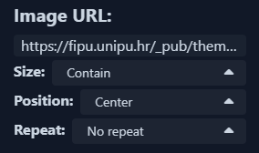 

**Line** *element* setting is:
- **Dashed**: *toggle* which changes the *appereance* of **line** *element*

 

 

#### 3.3.2. Variables
When *variable preview* is **enabled** then the **list** of all **variables** with their coresponding *inputs* will be showed instead.

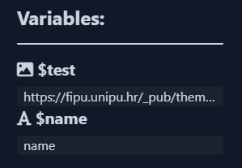

When opening *variables preview* for the first time, all *text* *variables* will have `placeholder` as input and all *images* *variables* will have the following image as placeholder:

## 3.4. Toolbar
The last section located above *canvas*. It contains *heading* with *version number*, *canvas* **scale slider** which as name implies adjusts the scale of canvas and **[Quill](https://quilljs.com) toolbar** which is *hidden* when **text** *element* is not selected.

# 4. Creating and testing variables
The whole reason this *PDF Tmeplate Maker* was made is the ability to **declare** and **use** **variables**.

To **create** a *variable* is really simple:
- to create a **text** *variable* write `$` **symbol** and then *any* amount of characters *without* spaces

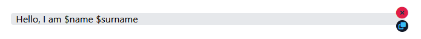

- to create a **image** *variable* write `$` **symbol** in **url** and then *any* amount of characters *without* spaces

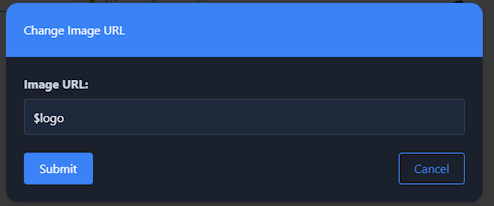

And now they are available in *variable* **list** after **Variable Preview** *toggle* is set to **active**.

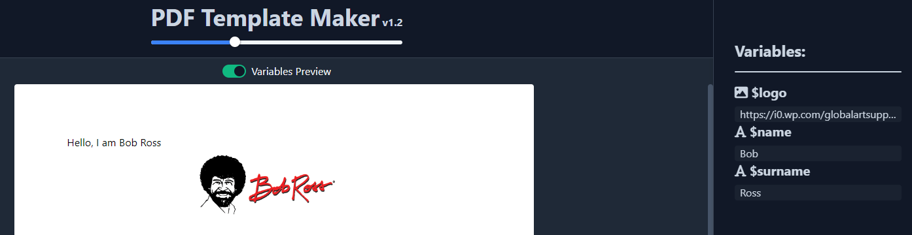