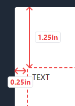

# PDF Template Maker
> Version: 1.2

## 1. INTRODUCTION
**PDF Template Maker** was created to solve the problem of creating simple templates fast and easy by providing a user-friendly interface for crafting personalized PDF documents using HTML elements. These templates can be used within another project under the name of *Fipu Internship System*. The *PDF Template Maker* template is separate from the *PDF Template Maker Service*, which solely purposes to convert created templates with provided inputs using *Playwright* into PDFs.

*PDF Template Maker* can be used on the [live site](https://html-to-pdf-maker.netlify.app) or locally by following the steps in [2. Getting Started](#2-getting-started) section.

### 1.1 Features
- **Drag-and-Drop Editing**: Arrange and customize elements within your PDF templates using vue-draggable.
- **Text Editing**: Edit text content using vue3-quill & katex.
- **Variable Preview**: Check how template/PDF would look prior to export.
- **Saving templates and PDF Export**: Save and load your templates for later use. Export your PDFs using vue-html-to-paper.

## 2. Getting Started
To run the project locally, use the following steps:

1. Clone this repository to your local environment.
2. Install the required dependencies using `npm install`.
3. Execute the command `node build.js` to generate the necessary CSS classes.
4. Run the development server using `npm run dev` and access the app at the provided link.

The project is now ready to be used.

## 3. Interface
The interface comprises the following sections:
- **Canvas**
- **Editor Bar**
- **Element Settings**
- **Toolbar**

### 3.1. Canvas
Upon opening the PDF Template maker, you'll be provided with a blank sheet of paper called *canvas*. 

This so-called *canvas* will be in the middle of the screen, available at all times. It's your workspace where you will drag and drop, edit, rearrange, clone, and delete *PDF elements*.

There is also a toggle called **Variable Preview** which is used to test the template and see how it behaves with different inputs, more about later.

### 3.2. Editor Bar
Left of the *canvas* is where the *editor bar* is located. It can be divided into 5 subsections:

- **undo/redo**
- **elements**
- **hierarchy**
- **PDF margins**
- **importing/exporting**

#### 3.2.1. Undo/redo
Self-explanatory, almost every program in existence has those functions. Though there are a few things to note:
- Key shortcuts `CTRL+Z/CTRL+Y` don't work due to *Quill* text editor. Therefore, to undo/redo, use the provided buttons.
- If no undo/redo action is possible, buttons will be faded and not clickable.
- Undo stack size is `200`.
- Every character typed in text counts as an action.
- Redo won't be cleared if after undoing, a change is applied. Same for undo.

#### 3.2.2. Elements
This subsection contains a **list** of available *elements* that can be used to create a template.
There are currently `3` available *elements* to choose from:

- **Text**
- **Image**
- **Line**

 

To use the provided *elements*, simply **drag and drop** them into the *canvas*. When an *element* is put onto the *canvas*, a ***parent** element* is created that contains the dropped *element*. 

A newly **created** *element* can be:
- **selected**: To **select** an *element*, simply **click** the *element*.
- **moved**: To **move** an *element* around the *canvas*, **click and hold** the *element* **4-way arrow icon**.
- **deleted**: To **delete** an *element* from its *parent*, **click** the *selected element* **red x icon**.
- **cloned**: To **clone** an *element* inside its *parent*, **click** the *selected element* **blue double square icon**.

 

The **Image** *element* has an additional **blue image icon** in the *center*. When clicked, it opens a *popup* where the *image url* can be changed.

> Note: **New** *elements* can be moved into the *hierarchy* directly and will therefore also be created on the canvas. However, they will only be created as a ***new parent* with the provided *element*, not as a *new element* inside an existing *parent*.

> Note: *Elements* can be moved into the *elements list*. Doing so will **delete** the moved *element*.

***Parent*** is an *element* that contains other *elements* **horizontally**. Therefore, if there are many *elements* in a single *parent* and there is not enough space, *elements* will **overflow**. To prevent *overflowing*, appropriate use of the *element width setting* is needed. More about it later.

A newly **created** *parent* can be:
- **moved**: To **move** a *parent* around the *canvas*, **click and hold** inside the *parent's bounds*. Don't click *child* elements, doing so will select the *child element*. 
- **deleted**: To **delete** a *parent* from the *canvas*, **click** the *parent's* **red x icon*. Doing so will **delete** all *child elements* inside the *parent*.
- **cloned**: To **clone** a *parent* onto the *canvas*, **click** the *parent's* **blue double square icon*. Doing so will **clone** the entire *parent* with all its *child elements* onto the *canvas*.

> Note: *Elements* can be moved from one *parent* to another. If when moving an *element* from a *parent* leaves the *parent* empty without elements, the *parent* is **deleted**.

> Note: Two *parents* can be **merged** by moving one *parent* into another at any spot.

> Note: A *parent* **cannot** be **selected**.

#### 3.2.3. Hierarchy
The third subsection in the *Editor Bar* is used to visually present the *canvas element* **structure** in a **tree-like** view.
A few *hierarchy* images were shown in the previous section since it's easier to showcase how *parents* and *elements* work.

Each *parent* in the *hierarchy* is presented with **bold blue** text and with **arrows** pointing

 to its *children elements*. *Child elements* show their **type** in **bold white** and their **content** or **value** after `:`.

Hovering with the mouse over a *parent/element* will **highlight** and **scroll to** the *parent/element* on the *canvas* and vice versa. The ***selected*** *element* is **highlighted** in **blue**.

> Note: On mouse hover for a few seconds: on *parent*, it will show **parent ID**. On *type*, it will show **child element ID**. On *content/value*, it will show the **entire** *content/value*.

> Note: *Elements* and *parents* can be moved around the *hierarchy* and from the *hierarchy*, but it is **NOT** recommended since it can behave **unexpectedly** and **break** the program. Use the *canvas* for moving *elements*/ *parents* instead.

#### 3.2.4. Margins

Margins are used to create **padding** for *canvas* *elements*.

- **PDF margin Y** controls **vertical** padding (*top & bottom*) from `0.25 - 1.25` inches.
- **PDF margin X** controls **horizontal** padding (*left & right*) from `0.25 - 1.25` inches.

 

> Note: Margins do **not** prevent *element* **overflow**.

#### 3.2.5. Importing/exporting

The last subsection contains `4` *functions* for **importing** & **exporting** *templates*:

1. **Load template**
    - Opens a window for loading **locally saved** *templates* in a specified **JSON** format. Upon loading, the *canvas* will update accordingly along with its *hierarchy*.
2. **Save template**
    - Opens a *popup* for providing a **name** with which the *template* will be **locally saved** in a specific **JSON** format.

3. **Save as PDF**
    - Opens the *browser's PDF saving functionality* that allows exporting the *canvas* in its **current state** as a *PDF file*.
4. **Save as HTML**
    - Opens a *popup* for providing a **name** with which the *template* will be **locally saved** in a specific **HTML** format.

    > Note: *Saved HTML* **won't** contain any *CSS formatting*.

### 3.3. Element Settings
Located right of the *canvas* with two main functionalities. The first one and the most important is, of course, as the *name* implies, **settings** for ***selected*** *element* where specific *values* can be adjusted. The second one is **variable preview list** for **testing** *templates*.

> Note: If **no** *element* is selected and *variable preview* is turned **off**, *elements settings* will be **empty**.

#### 3.3.1. Settings

Each *element type* has its own unique settings, but they also share many settings amongst themselves. Since each and every *element* is inside a *parent*, they all contain *parent* settings since *parents* cannot be selected. All *elements* also have *element data* which is **ID** and **Type** *readonly*.

 

**Parent** *element* settings are:
- **Parent Height**: Controls the *parent* height **type**
    - **Fit**: Matches the height of the biggest *child* *element*
    - **Divide**: Adjusts height so that it occupies an equal space as other *parents* with **divide** height type
    - **Grow**: Expands height so that it occupies all space left in the canvas
    - **Set**: Provides an *additional number input* to set the **exact** height in **pixels**

- **Justify Parent**: Controls the way *child* elements will be **aligned horizontally**
    - **Start**: Aligns *children* against the **start** of the *parent*
    - **Center**: Aligns *children* in the **center** of the *parent*
    - **End**: Aligns *children* against the **end**  of the *parent*
    - **Between**: Aligns *children* in such a way that there is an *equal* amount of space **between** each *child*
    - **Around**: Aligns *children* in such a way that there is an *equal* amount of space on **each side** of each *child*
    - **Evenly**: Aligns *children* in such a way that there is an *equal* amount of space **around** each *child*, but also **accounting** for the **doubling of space**

**General** *element* settings are:
- **Element Width**: Controls the *element* width **type**
    - **Fit**: Matches the width of the *element* content
    - **Divide**: Adjusts width so that it occupies an equal space as other *elements* with **divide** width type within the *parent* 
    - **Grow**: Expands width so that it occupies all space left in the *parent*
    - **Set**: Provides an *additional number input* to set the **exact** width in **pixels**
- **Element Height**: Controls the *element* height **type**
    - **Fit**: Matches the height of the *element* content
    - **Grow**: Expands height so that it occupies all space left in the *parent*
    - **Set**: Provides an *additional number input* to set the **exact** height in **pixels**

**Text** *element* setting is:
- **Text value**: *Readonly* **field** that shows text **value**

 

**Image** *element* settings are:
- **Image URL**: *Readonly* **field** that shows image **URL** **value**
- **Size**: Controls the *image* **size** within *element*
    - **Auto**: *Displays* the image at its **default** size
    - **Cover**: *Scales* the image until it **fills** the *element*
    - **Contain**: *Scales* the image to the **outer edges** of the *element* without *cropping* or *stretching*
- **Position**: Controls the *image* **position** within *element*
    - *Bottom, Center, Left, Left bottom, Left top, Right, Right bottom, Right top, Top*
- **Repeat**: Controls the *image* **repetition** within *element*
    - **No repeat**: Image **won't** *repeat*
    - **Repeat**: Image will *repeat* **horizontally** & **vertically**
    - **Repeat X**: Image will *repeat* **horizontally**
    - **Repeat Y**: Image will *repeat* **vertically**

 

**Line** *element* setting is:
- **

Dashed**: *Toggle* which changes the *appearance* of the **line** *element*

 

 

#### 3.3.2. Variables
When *variable preview* is **enabled**, then the **list** of all **variables** with their corresponding *inputs* will be shown instead.

When opening *variables preview* for the first time, all *text variables* will have `placeholder` as input and all *images variables* will have the following image as a placeholder:

## 3.4. Toolbar
The last section located above the *canvas*. It contains a *heading* with a *version number*, a *canvas* **scale slider** which as the name implies adjusts the scale of the canvas and the **[Quill](https://quilljs.com) toolbar** which is *hidden* when the **text** *element* is not selected.

# 4. Creating and testing variables
The whole reason this *PDF Template Maker* was made is the ability to **declare** and **use** **variables**.

To **create** a *variable* is really simple:
- To create a **text variable**, write `$` **symbol** and then any amount of characters *without* spaces

- To create an **image variable**, write `$` **symbol** in **url** and then any amount of characters *without* spaces

And now they are available in the *variable* **list** after the **Variable Preview** *toggle* is set to **active**.

